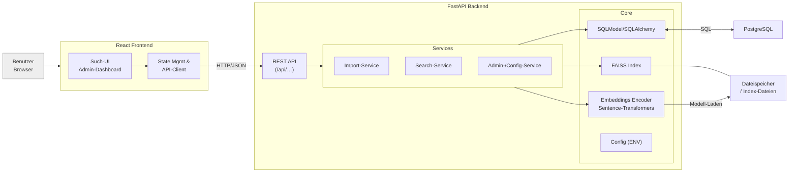
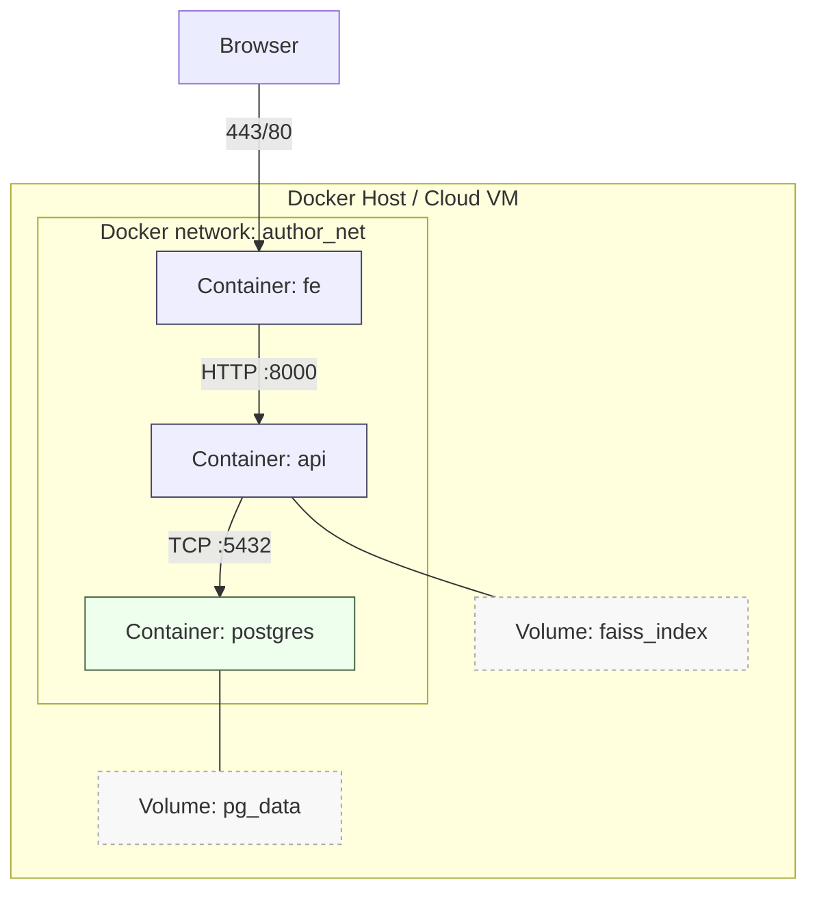

# Author Retrieval System

Dieses Projekt implementiert einen **Author Retrieval Service** zur Verwaltung und Suche von wissenschaftlichen Abstracts und Autoreninformationen.
Es kombiniert einen **FastAPI**-basierten Backend-Service, ein **React**-Frontend und **FAISS** für semantische Suche mit Embeddings.

---

## 📦 Projektstruktur

```
.
├── backend/                  # FastAPI Backend
│   ├── app/
│   │   ├── api/              # API-Routen (Admin, Abstracts, Authors, Topics)
│   │   ├── embeddings/       # Embedding-Encoder
│   │   ├── index/            # FAISS-Index-Logik
│   │   ├── models/           # SQLModel-Datenmodelle
│   │   ├── services/         # Business-Logik (Import, Suche)
│   │   ├── config.py         # Konfiguration aus ENV
│   │   └── main.py           # App-Einstiegspunkt
│   ├── Dockerfile
│   └── requirements.txt
├── frontend/                 # React Frontend
│   ├── src/
│   │   ├── components/       # UI-Komponenten
│   │   └── pages/            # Seiten (Admin, Suche etc.)
│   ├── Dockerfile
│   └── package.json
├── docker-compose.yml        # Multi-Service Setup (DB, Backend, Frontend)
└── README.md
```

---

## 🏠 Gesamtsystem



---

## 🚀 Funktionen

- **Import** von Abstract-Daten im JSON-Format
- Verwaltung von **Autoren** und **Themen**
- **Semantische Suche** mittels FAISS und Sentence Transformers
- **Ähnlichkeitsbewertung** (Cosine Similarity oder FAISS-Heuristik)
- **Administration**:
  - Gerät (CPU/GPU) für Embedding setzen
  - Score-Anzeige und Modus konfigurieren
  - FAISS-Indizes neu aufbauen
  - Datenbank zurücksetzen (Hard-Reset)
- Frontend mit Such-UI und Admin-Dashboard

---

## 🛠️ Installation & Initialisierung

### 1. Voraussetzungen
- Docker & Docker Compose
- Internetzugang für initialen Modell-Download

### 2. `.env` Datei erstellen

Erstelle im Projektverzeichnis eine `.env`-Datei (neben `docker-compose.yml`):

```env
POSTGRES_DB=abstractdb
POSTGRES_USER=user
POSTGRES_PASSWORD=password
FRONTEND_ORIGIN=http://localhost:8080
EMBED_MODEL=all-MiniLM-L6-v2
EMBED_DEVICE=cpu
SHOW_SCORES=false
SCORE_MODE=cosine
VECTOR_DIM=384
LOG_LEVEL=INFO
```

> `EMBED_DEVICE` kann `cpu`, `cuda` oder `mps` sein – abhängig von deiner Hardware.

### 3. Container bauen & starten

```bash
docker compose build
docker compose up
```

Backend: [http://localhost:8000/docs](http://localhost:8000/docs)  
Frontend: [http://localhost:8080](http://localhost:8080)

---

## 💡 Nutzung

### Admin-Dashboard
1. **Status einsehen** – Modellname, Gerät, Daten- und Indexzähler
2. **Modellgerät ändern** – CPU/GPU auswählen und speichern
3. **Score-Konfiguration** – Anzeige & Modus wählen
4. **Import** – JSON-Datei im unterstützten Format hochladen
5. **Reindex** – FAISS-Indizes neu erstellen
6. **Reset** – Datenbank leeren & Schema neu anlegen
7. **Log-Level** - Log-Level verändern

### Suche
- Suche nach Abstracts oder Autoren basierend auf semantischer Ähnlichkeit. Filterung nach Topic möglich.

---

## ⚙️ Technische Details

- **Backend**: FastAPI, SQLModel, SQLAlchemy, psycopg2
- **Embeddings**: `sentence-transformers` (Standard: `all-MiniLM-L6-v2`)
- **Vektorsuche**: FAISS mit konfigurierbarer Thread-Limitierung (`OMP_NUM_THREADS=1` etc.)
- **Frontend**: React + Tailwind CSS
- **DB**: PostgreSQL

### Thread-Limitierung
Zur Stabilisierung bei Multi-Core-Setups:
```python
import os, faiss
os.environ["OMP_NUM_THREADS"] = "1"
os.environ["MKL_NUM_THREADS"] = "1"
os.environ["VECLIB_MAXIMUM_THREADS"] = "1"
faiss.omp_set_num_threads(1)
```

---

## 🧪 Entwicklung

### Backend lokal starten (ohne Docker)
```bash
cd backend
pip install -r requirements.txt
uvicorn app.main:app --host 127.0.0.1 --port 8000 --workers 1
```

### Frontend lokal starten
```bash
cd frontend
npm install
npm start
```

---


---


---

## 📂 Erwartete JSON-Datenstruktur beim Import

In der Praxis wird eine **Liste von Abstract-Objekten** importiert, bei denen **IDs bereits vergeben sind**.  
Diese IDs werden vom Backend **übernommen und validiert**. Zusätzliche Felder, die nicht im Schema existieren, werden ignoriert.

### Reales Beispiel (entspricht dem produktiven Format)

```json
[
  {
    "id": 1477,
    "title": "Mortality in severe mental illness: first time results from statutory health insurance in Germany",
    "submission_date": "2017-02-01T00:00:00",
    "publication_date": null,
    "language_ref": 255,
    "content_raw": "<objective>...</objective><methods>...</methods><results>...</results>",
    "content": "a:3:{s:9:\"objective\";s:...}",

    "word_count": null,
    "keywords": null,

    "topic_id": 15,
    "topic_title": "Cross-disorder mechanisms and principles",

    "session_id": 343,
    "session_title": "Increased morbidity and mortality among patients with severe mental illness",

    "authors": [
      {
        "author_id": 1476,
        "inserted": "2017-08-30T18:40:29",
        "updated": "2025-04-06T20:19:55",
        "participant_ref": 2869,
        "academicdegree": "Prof. Dr. Dr.",
        "affiliationorganisation": "2869",
        "affiliationcity": "Aachen",
        "affiliationcountry_ref": 83
        /* … weitere Felder möglich */
      }
    ]
  }
]
```

### Feldmapping & Regeln

**Abstract (Tabelle `abstract`)**
- `id` *(int, **wird übernommen**)* – Primärschlüssel aus der Quell-Datenbank.
- `title` *(string, erforderlich)*
- `content_raw` *(string, erforderlich)* – Originaltext (z. B. mit XML/HTML-Tags).
- `content` *(string, optional)* – alternative, z. T. serialisierte Darstellung (wird als Text gespeichert).
- `submission_date`, `publication_date` *(string|null, optional)* – ISO-8601 (z. B. `"2017-02-01T00:00:00"`).
- `language_ref`, `word_count`, `keywords`, `session_id`, `session_title` *(optional)* – werden direkt in den entsprechenden Spalten gespeichert.
- `embedding` *(array[float], **nicht senden**)* – wird serverseitig berechnet.

**Topics (Tabelle `topic`)**
- `topic_id` *(int, optional)* – wenn gesetzt, wird das Abstract mit diesem Topic verknüpft.
- `topic_title` *(string, optional)* – kann zur Anlage/Zuordnung eines Topics verwendet werden, wenn keine ID vorhanden ist.
  > Wenn **beide** vorhanden sind, hat i. d. R. die ID Priorität. Der Titel dient dann rein dokumentarisch.

**Autoren (Tabelle `author` & Link-Tabelle)**
- `authors` *(array[object], optional)* – Liste von Autorenobjekten.
  - `author_id` *(int, empfohlen)* – wird zur **Verknüpfung** genutzt. Existiert der Autor noch nicht, **kann** er mit Minimaldaten angelegt werden.
  - Weitere Felder (z. B. `academicdegree`, `affiliationcity`, …) sind **nicht Teil des aktuellen DB-Schemas** (`Author` hat nur `id`, `name`, `embedding`) und werden beim Import **ignoriert**.
  - Falls `name` vorhanden ist, kann er gesetzt werden. Andernfalls bleibt `name` leer/unspezifiziert.

> **Wichtig:** Die Importlogik dedupliziert Mehrfachzuordnungen und erzeugt bei Bedarf **Embeddings**. Nur Datensätze mit Embeddings werden in den **FAISS-Indizes** berücksichtigt.

### Alternative Minimalstruktur (ohne IDs aus der Quelle)

Für Tests/PoCs kannst du auch ohne vorab vergebene IDs importieren. In dem Fall vergibt das Backend die IDs selbst; Autoren/Topics können per Namen angelegt werden:

```json
[
  {
    "title": "Beispieltitel",
    "content_raw": "Text…",
    "authors": ["Alice Example", "Bob Example"],
    "topics": ["NLP", "IR"]
  }
]
```

---

## 💻 Hardware-Hinweise zum Docker-Setup (aktualisiert)

- **Docker-Standard:** Embeddings laufen auf **CPU** (empfohlen für das Compose-Setup).
- **Lokal (ohne Docker):** Du kannst im Admin-Dashboard auf **CUDA** (NVIDIA) oder **MPS** (Apple Silicon) umstellen, sofern verfügbar.
- **Docker-Einschränkungen:**
  - **MPS** wird **nicht** an Container durchgereicht.
  - **CUDA** erfordert das NVIDIA Container Toolkit; diese Konfiguration wurde bisher **nicht implementiert**.

---

## ☁️ Deployment / Infrastruktur

### Docker-Compose



**Interpretation:**  
- `fe`: React-Frontend (Port 8080 → Browser).  
- `api`: FastAPI-Backend (Port 8000).  
- `postgres`: persistente DB.  
- `faiss_index` & `pg_data`: Volumes für Index- und DB-Daten.  

Alle Container sind im Compose-Netzwerk `author_net` verbunden.

---

## 📄 Lizenz
MIT License
